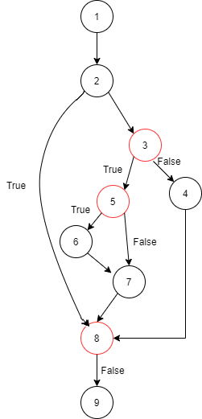
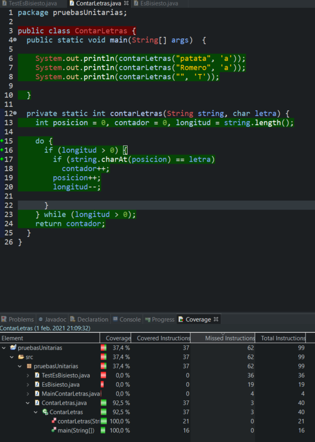

# Tarea 3.7: Prueba del camino básico y Eclemma (2) esBisiesto.

## 1. Grafo del flujo del programa.


## 2. Complejidad ciclomática.
Siendo:

M = Complejidad ciclomática.

E = Número de aristas del grafo. Una arista conecta dos vértices si una sentencia puede ser ejecutada inmediatamente después de la primera.

N = Número de nodos del grafo correspondientes a sentencias del programa.

P = Número de componentes conexos, nodos de salida

```
M = E − N + 2P
```
M = 5 - 5 + 2 * 1 = 2
```
M = Número de condiciones + 1
```
M = 1 + 1 = 2
```
M = Número de condiciones + Número de retornos o salidas 
```
M = 1 + 1 = 2

## 3. Caminos independientes. Tabla con las siguientes columnas:
| Número del camino | Nodos/aristas del camino |  Prueba (valores de las condiciones) | Entrada (variables)  |  Salida (resultado esperado) |
|:-:|:-:|:-:|:-:|:-:|
| 1-2-4-5  | 4/3  |  2020 |  Entero (año) |  Cadena de texto |
| 1-2-3-5  | 4/3  |  2021 |  Entero (año) |  Cadena de texto |

## 4. Ficheros .java del código.
[Archivo .java](./ContarLetras.java)

## 5. Pantallazo de la vista Coverage con el 100% de cobertura en los métodos implicados (herramienta Eclemma)

