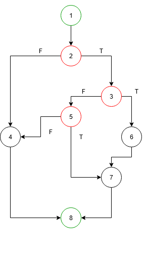
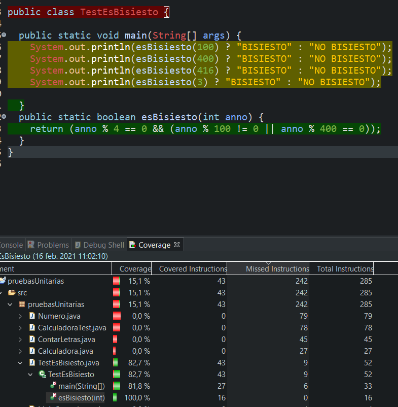

# Tarea 3.7: Prueba del camino básico y Eclemma (2) esBisiesto.

## 1. Grafo del flujo del programa.


## 2. Complejidad ciclomática.
Siendo:

M = Complejidad ciclomática.

E = Número de aristas del grafo. Una arista conecta dos vértices si una sentencia puede ser ejecutada inmediatamente después de la primera.

N = Número de nodos del grafo correspondientes a sentencias del programa.

P = Número de componentes conexos, nodos de salida

```
M = E − N + 2P
```
M = 10 - 8 + 2 * 1 = 4

## 3. Caminos independientes. Tabla con las siguientes columnas:
| Número del camino | Nodos/aristas del camino |  Prueba (valores de las condiciones) | Entrada (variables)  |  Salida (resultado esperado) |
|:-:| :-: | :-: | :-: | :-: |
| 1 | 1-2-3-5-7-8 | True-False-True | 400 | TRUE |
| 2 | 1-2-3-5-4-8 | True-False-False | 100 | FALSE |
| 3 | 1-2-3-6-7-8 | True-True | 416 | TRUE |
| 4 | 1-2-8 | False | 3 | FALSE |

## 4. Ficheros .java del código.
[Archivo .java](./TestEsBisiesto.java)

## 5. Pantallazo de la vista Coverage con el 100% de cobertura en los métodos implicados (herramienta Eclemma)

