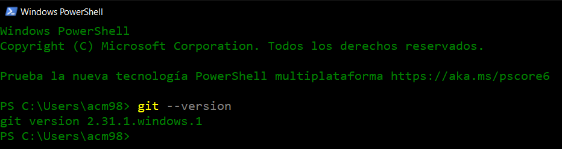
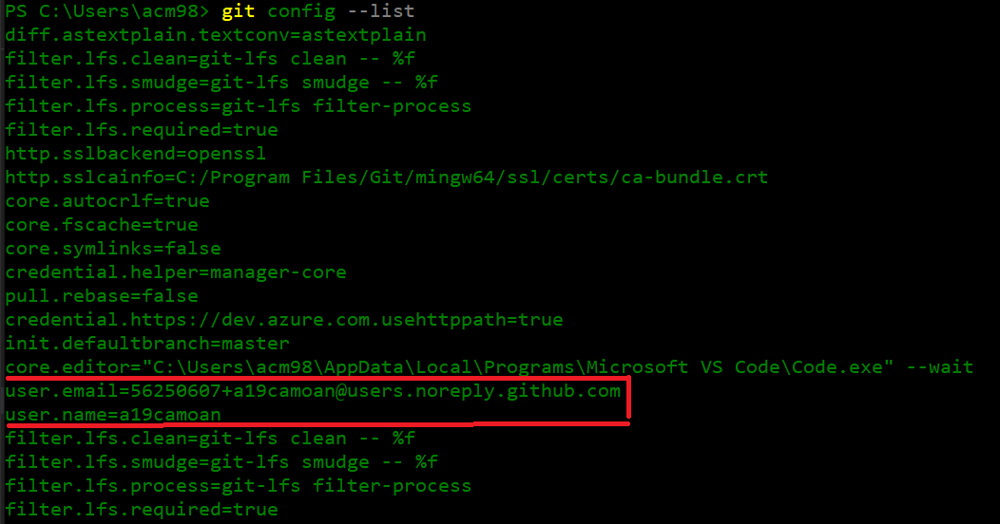
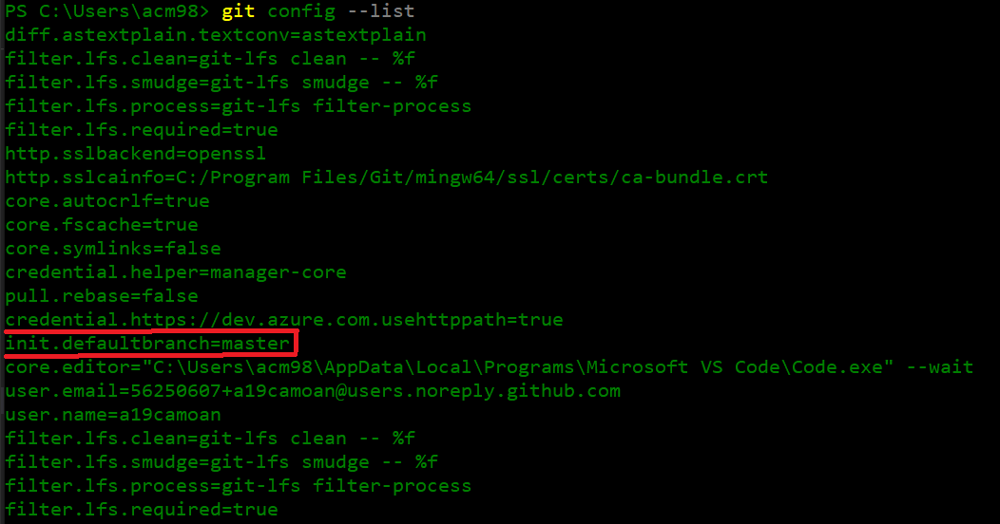
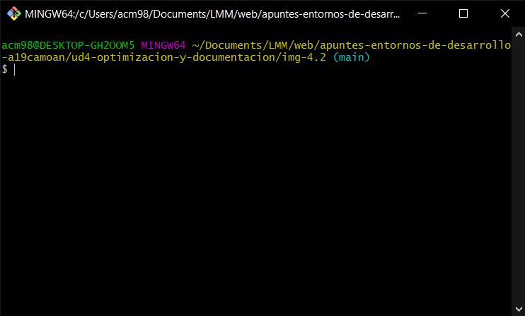
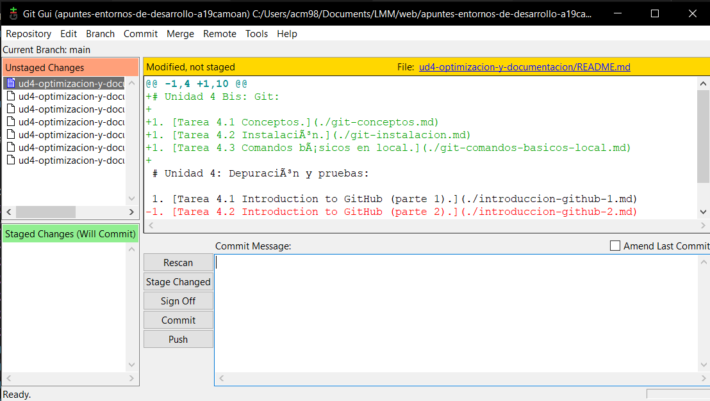

# 4.2: Instalación

1. Versión instalada

    

1. Configuración de identidad (correo y nombre)

    
    
1. Configuración del nombre de la rama por defecto.

    

1. Git bash.

    

1. Git GUI.

    