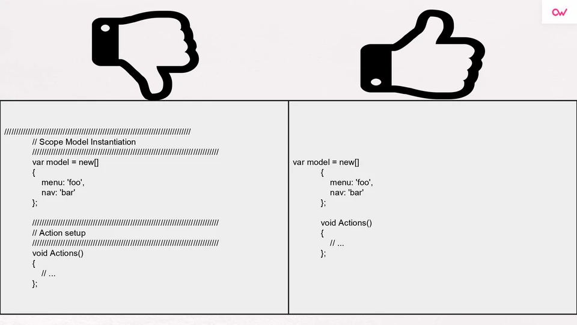
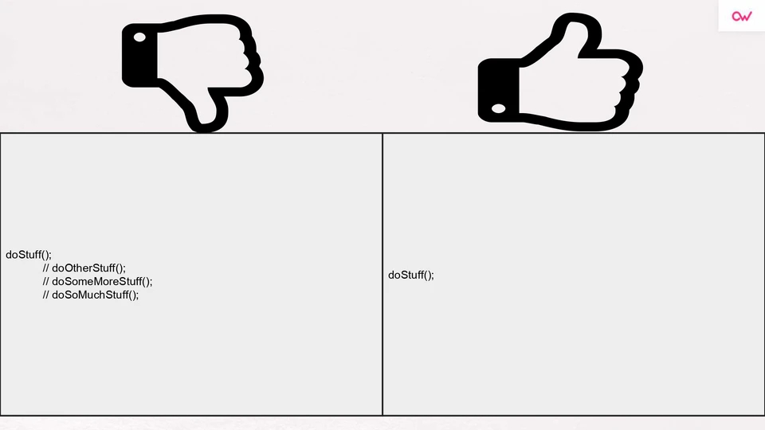
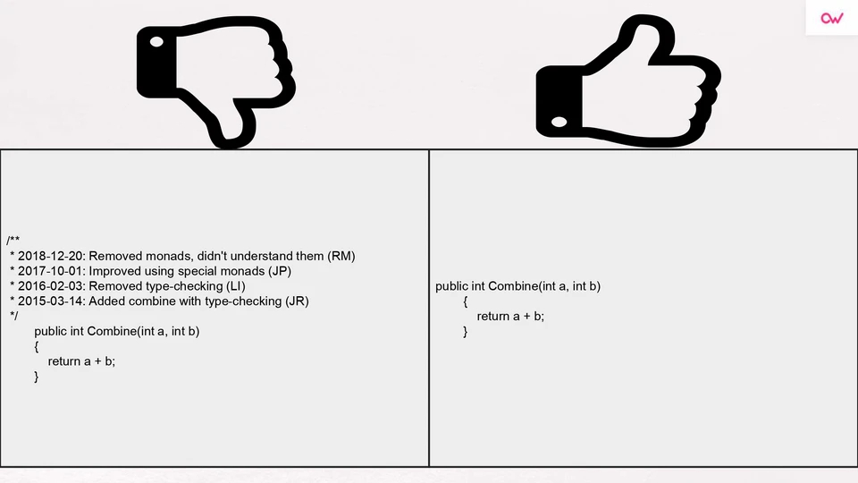

## 1. Qué es la refactorización.
Es una técnica de la ingeniería de software para reestructurar un código fuente, alterando su estructura interna sin cambiar su comportamiento externo.

Se realiza a menudo como parte del proceso de desarrollo del software: los desarrolladores alternan la inserción de nuevas funcionalidades y casos de prueba con la refactorización del código para mejorar su consistencia interna y su claridad.

## 2. Qué es el clean code o código limpio.
Es una filosofía de desarrollo de software que consiste en aplicar técnicas simples que facilitan la escritura y lectura de un código, volviéndolo más fácil de entender.

## 3. Code smells: Explica al menos seis code smells.
- Bloater:

    Los bloaters son códigos, métodos y clases que han aumentado a proporciones tan gigantescas que es difícil trabajar con ellos. Por lo general, estos olores no surgen de inmediato, sino que se acumulan con el tiempo a medida que evoluciona el programa (y especialmente cuando nadie hace un esfuerzo por erradicarlos).

- Couplers:

    Todos los olores de este grupo contribuyen a un acoplamiento excesivo entre clases o muestran lo que sucede si el acoplamiento se reemplaza por una delegación excesiva.

- Change Preventers:

    Estos olores significan que si necesita cambiar algo en un lugar de su código, también debe realizar muchos cambios en otros lugares. Como resultado, el desarrollo de programas se vuelve mucho más complicado y costoso.

- Dispensables:

    Un prescindible es algo inútil e innecesario cuya ausencia haría el código más limpio, más eficiente y más fácil de entender.

- Object-Orientation Abusers:

    Todos estos olores son una aplicación incompleta o incorrecta de los principios de programación orientada a objetos.

- Couplers:

    Todos los olores de este grupo contribuyen a un acoplamiento excesivo entre clases o muestran lo que sucede si el acoplamiento se reemplaza por una delegación excesiva.

## 4. Comentarios innecesarios.
Evitar marcadores posicionales

No dejar el código comentado en su código base

No dejar comentarios de diario

## 5. Nombres de variables, de métodos y de clase.
El nombre de una variable, función o clase debe indicar por qué existe, qué hace y cómo se usa. Si el nombre requiere un comentario, significa que el nombre no cumple su cometido. Las clases y variables no deben ser verbos y los métodos sí.

## 6. Métodos limpios: longitud, nombre, parámetros.

## 7. Ley de Demeter.

La Ley de Demeter utilizada en el desarrollo de software, particularmente en la programación orientada a objetos. En su forma general, es un caso específico de loose coupling. Esta directiva fue inventada en la Universidad Northeastern (Boston, Massachusetts) a finales del año 1987, y puede ser sustancialmente resumida de las siguientes maneras:

- Cada unidad debe tener un limitado conocimiento sobre otras unidades y solo conocer aquellas unidades estrechamente relacionadas con la unidad actual.
- Cada unidad debe hablar solo a sus amigos y no hablar con extraños.
- Solo hablar con sus amigos inmediatos.

## 8.