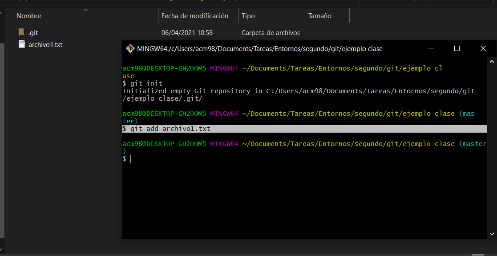

# 4.3: Comandos básicos en local.

## 1. Transforma el directorio actual en un repositorio de Git. Se añade un subdirectorio de .git con todos los archivos necesarios del repositorio.

## 2. Especifica qué archivos quieres añadir al repositorio (a staging area, staged). Prepara los archivos modificados.

## 3. Confirma los cambios (a directorio git, committed).

## 4. Clona un repositorio existente.

## 5. Muestra el estado de los archivos.

## 6. Muestra estado abreviado.

## 7. Ignora archivos.

Archivo .gitignore

## 8. Mostrar los cambios: líneas exactas que fueron añadidas y eliminadas. Compara lo que tienes en tu directorio de trabajo con lo que está en el área de preparación.

git dif

## 9. Mostrar los cambios: líneas exactas que fueron añadidas y eliminadas. Compara tus cambios preparados con la última instantánea confirmada.

git diff --staged

git diff --cached

## 10. Confirma los cambios sin pasar por el área de preparación (a directorio git, committed).

git commit -a

## 11. Eliminar archivos del directorio de trabajo y del área de preparación.

git rm

## 12. Renombrar archivos del directorio de trabajo y del área de preparación.

git mv

## 13. Muestra el historial de confirmaciones.

git log

## 14. Muestra sólo las dos últimas confirmaciones indicando las diferencias introducidas en cada confirmación.

git log -p -2

## 15. Rectifica el último commit.

git commit --amend

## 16. Deshaz un archivo preparado (indicado en git status).

git reset HEAD

## 17. Deshaz un archivo modificado (peligroso) (indicado en git status).

git checkout --[nombre del archivo]
