## 1. Renombrar métodos.
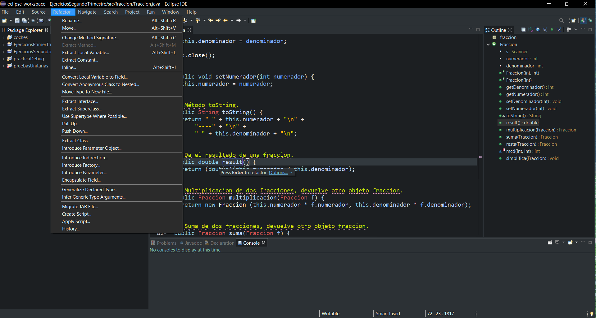

## 2. Renombrar paquetes
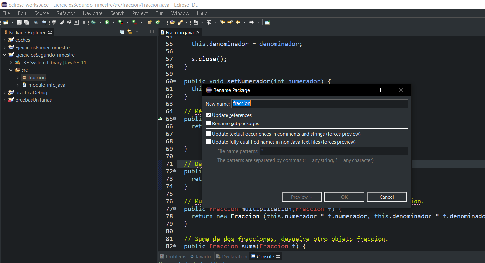

## 3. Encapsula campo
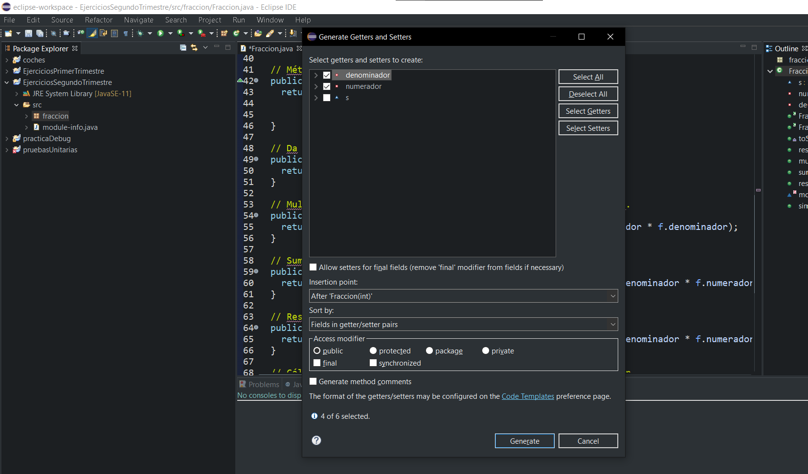

## 4. Extrae clase
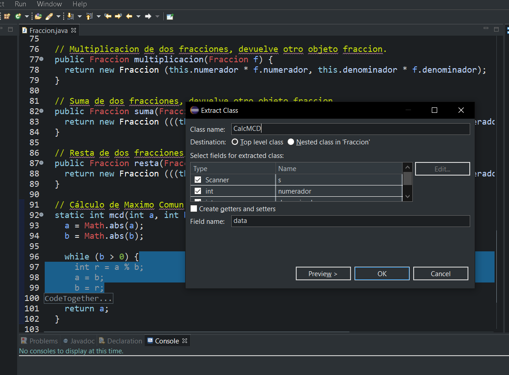

## 5. Extrae interface
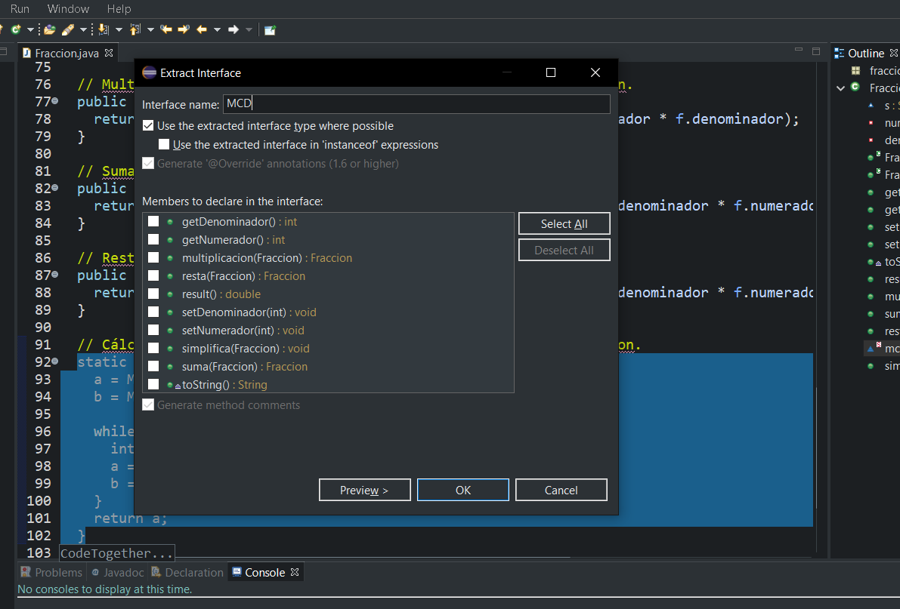

## 6. Extrae constante
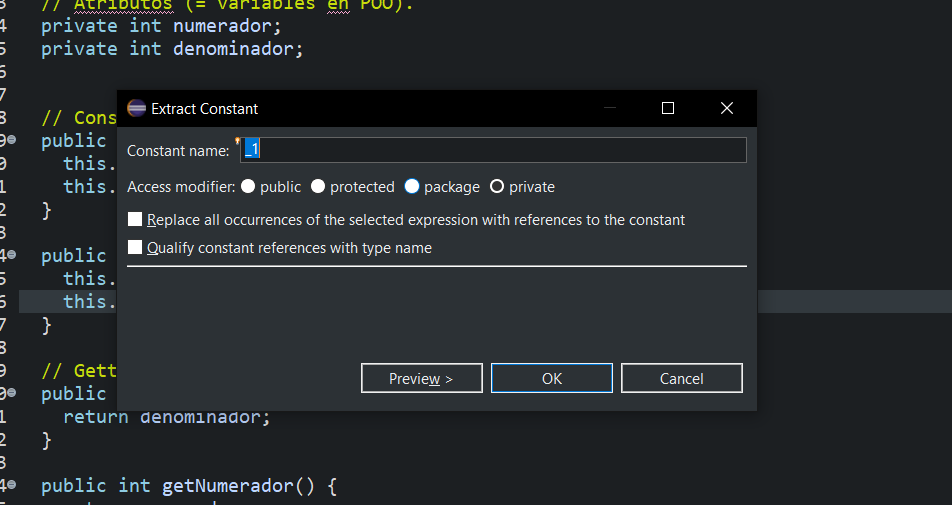

## 7. Extrae método
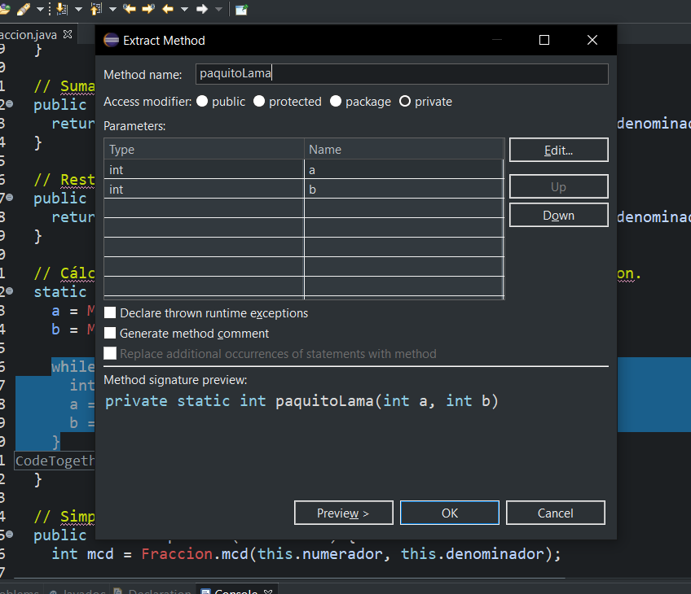

## 8. Extrae variable local
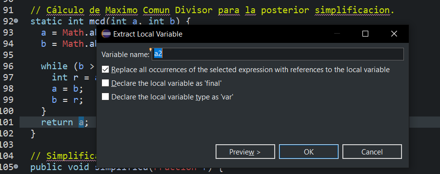

## 9. Todo en una línea (inlining)
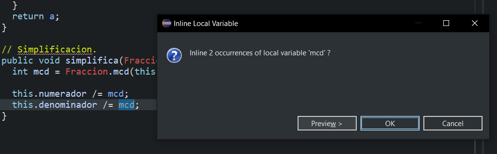

## 10. Subir/bajar (pull up/push down)
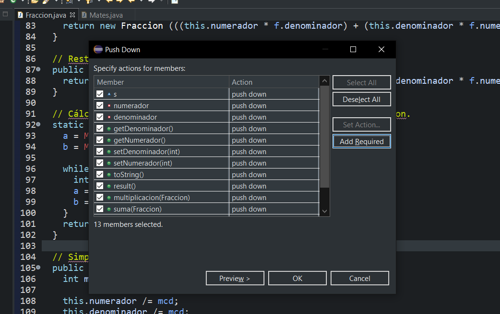
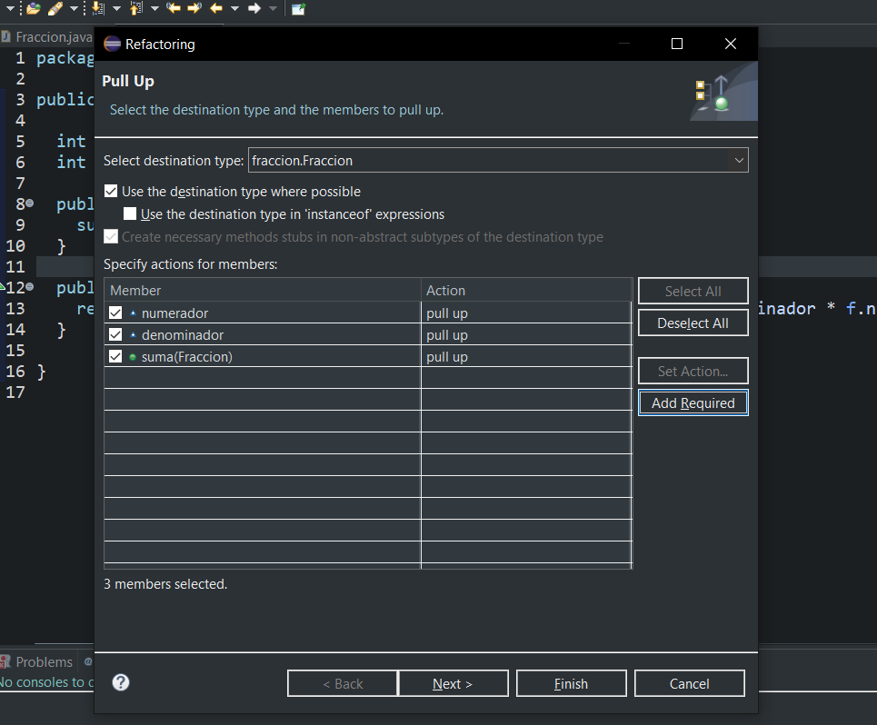