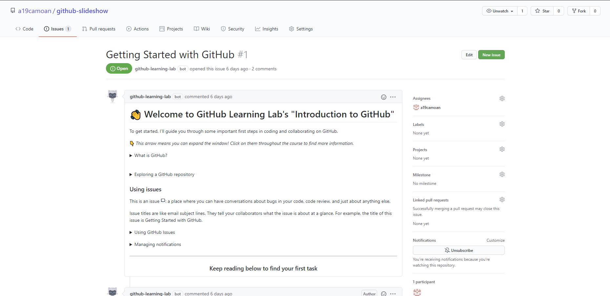
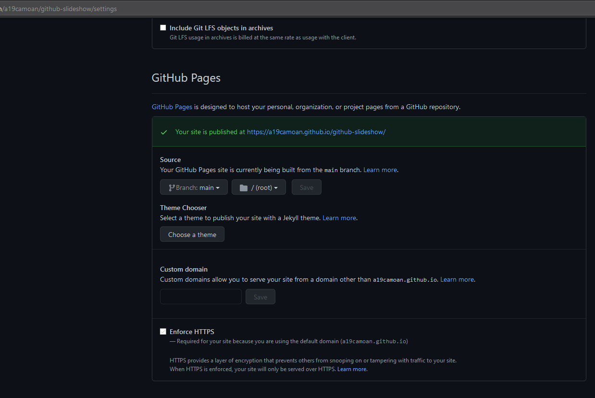
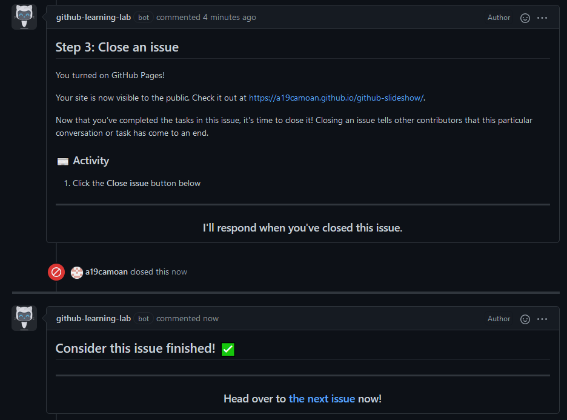
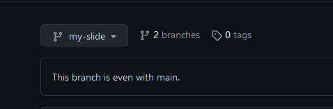

# Tarea 4.1 Introduction to GitHub (parte 1)

## Assign the first issue to yourself.

## Turn on GitHub Pages in the settings page of the repository.

## Cease a conversation by closing an issue.

## Create a branch for introducing new changes.

## Busca en Wikipedia e indica:
* ### Qué es GitHub y su relación con Git

  GitHub es una página web donde se pueden almacenar y publicar repositorios que usen el controlador de versiones Git.

* ### Compañía dueña de GitHub

  Microsoft

## Qué es una rama en el código (branch of the code).
Línea de trabajo alterna donde el software puede ser modificado sin riesgos.

## Qué es una nueva característica en el código (new feature).

## Qué es un pull request.
Es una solicitud de merge en la que otros usuarios pueden opinar y sugerir mejoras antes de su implementación.

## Qué es un merge.
Unifica 2 ramas al commit más reciente.

## Qué es un issue.
Son hilos de discusión donde se informan de errores, solicitud de funcionalidades o hasta hacer preguntas.

## Qué es una mención y qué implica.
Es una forma de hacerle llegar una notificación a un usuario concreto al que le llegará un mensaje por correo electrónico notificándole y/o un aviso en GitHub.

## Qué es una etiqueta (label) y por qué su uso.
Etiqueta los issues en categorías configurables y son útiles en la organización y clasificación de estos.

## Qué son las notificaciones. Indica las tres opciones de notificaciones.
Una notificación es comunicar al usuario que ha sido notificado o se ha producido un cambio en los repositorios en los que tenga activadas estas.

Participating and @metions, All Activity y Ignore.

## Qué son GitHub Pages.
Es una forma fácil y sencilla de crear una página web usando GitHub para presentar tus proyectos, portfolio, etc.

## Qué es GitHub Flow.
Es un flujo de trabajo en el que los cambios en el código no son aplicados directamente. Se usan varias ramas para desarollar haciendo merges cuando los cambios son seguros de publicar.