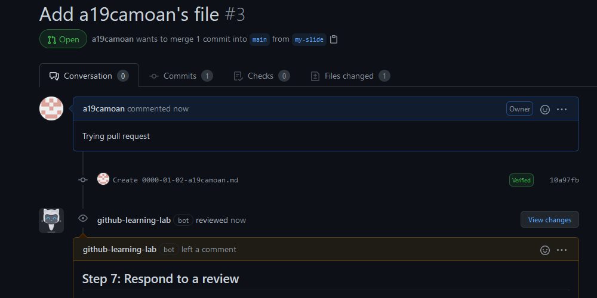
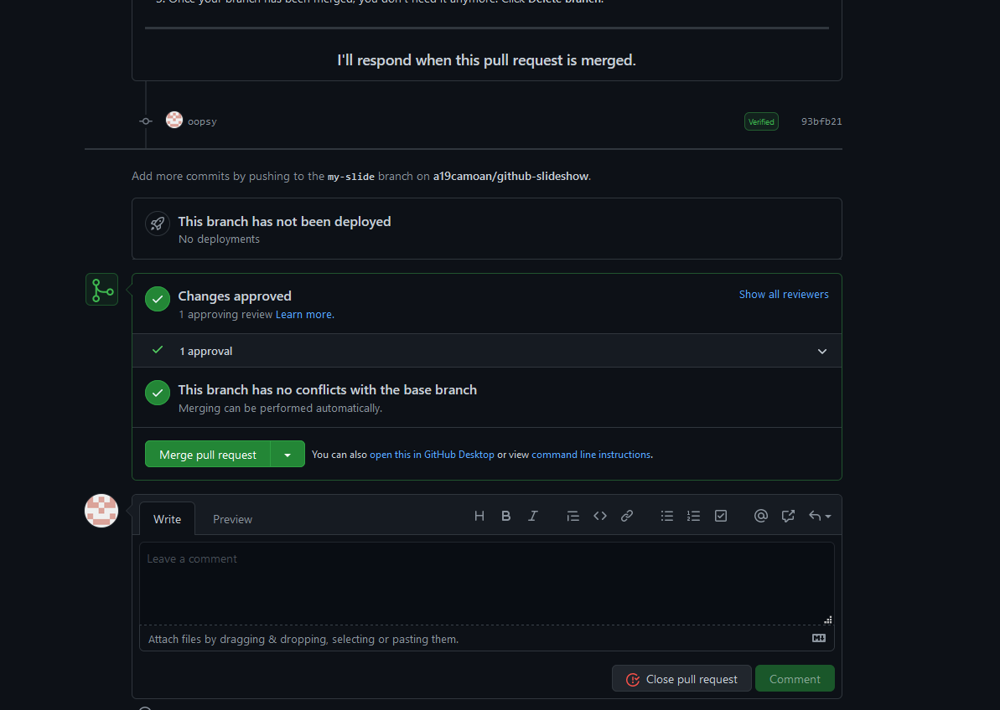
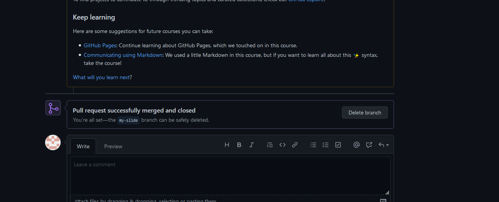

# Tarea 4.2 Introduction to GitHub (parte 2)

## Commit your file to the branch.

## Open a pull request to propose your new file to the codebase.

## Respond to a PR review.

## Make your changes live by merging your PR.

