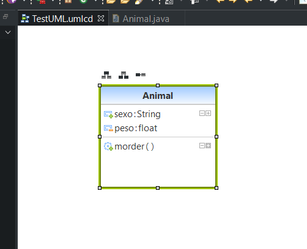
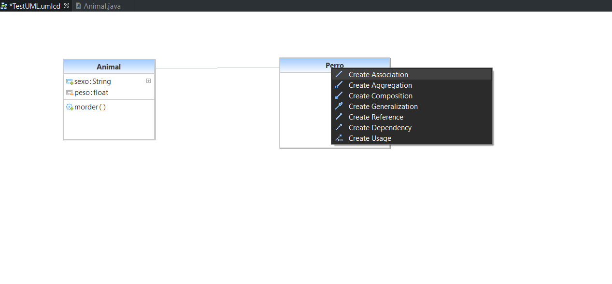
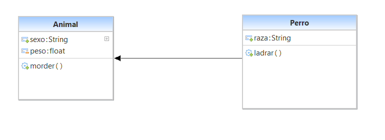
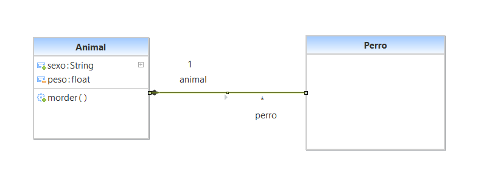
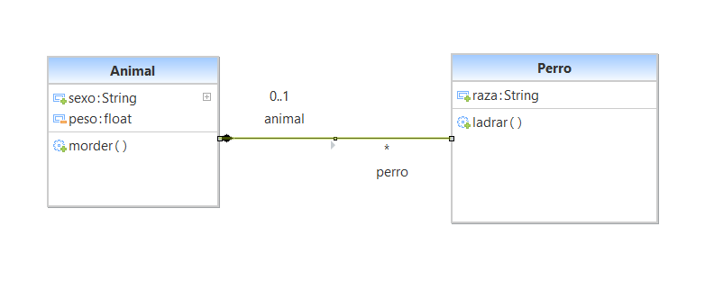
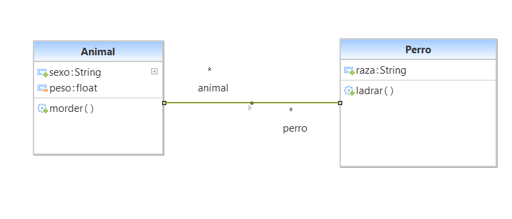

# Genera código a partir de diagramas de clases

# Traza diagramas de clases e identifica los siguientes conceptos. 

## Clases. Atributos, métodos y visibilidad.

La clase es todo el recuadro y su nombre es "Animal".
sexo y peso son atributos de los cuales peso tiene visibilidad "private" (-) y sexo "public" (+).
Morder sería el método con visibilidad "public" (+).

## Relaciones.

1. Herencia

1. Composición

1. Agregación

1. Asociación
